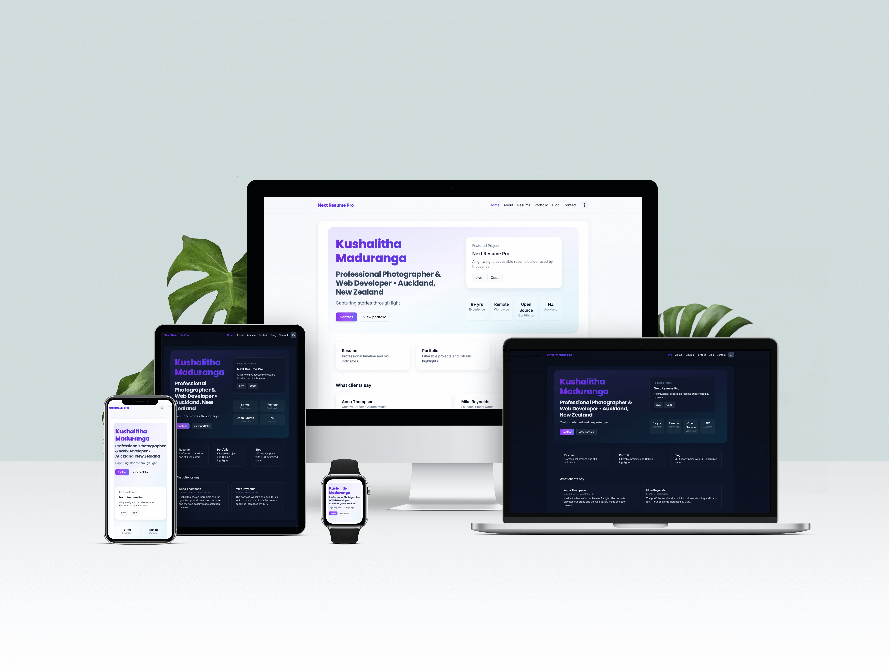
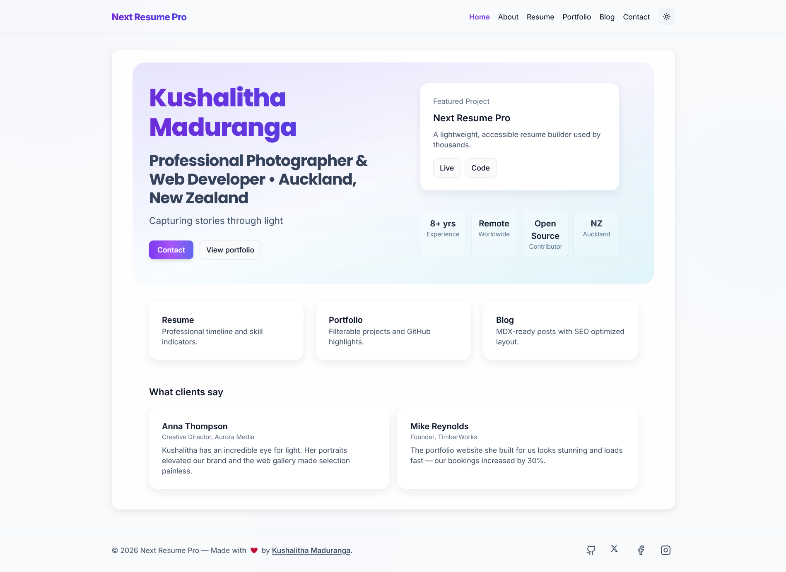
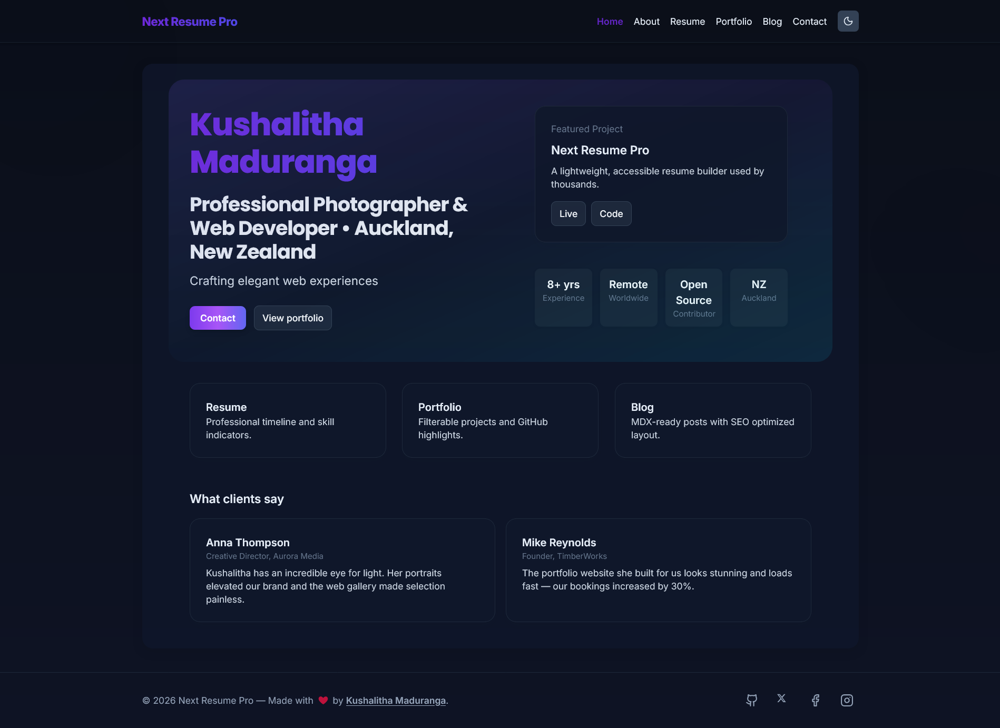
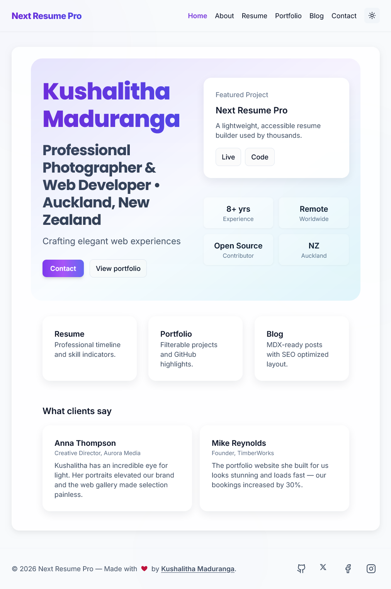
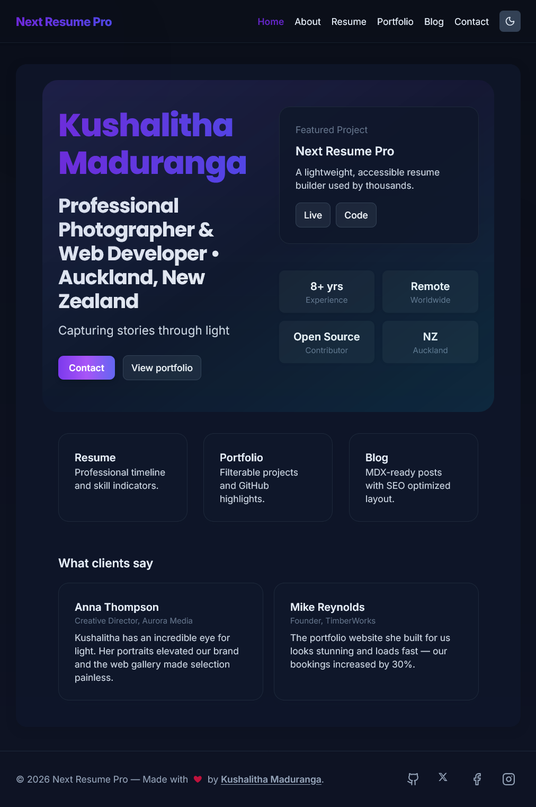
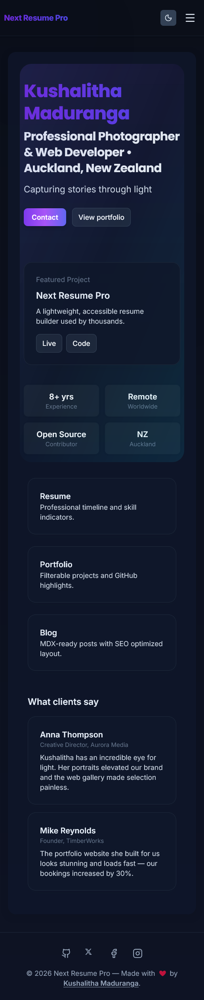

<!--
Next Resume Pro v2.0.0
Author: Kushalitha Maduranga
Year: 2026

License:
- Code (TypeScript, JavaScript, build scripts): MIT License
- UI / Design (CSS, layout, visual components): CC BY 4.0
	Attribution Required

Repository:
https://github.com/Kushalitha
-->

<p align="center">
  <h1 align="center" style="color:#7C3AED">Next Resume Pro</h1>
  <p align="center"><strong>A modern resume &amp; portfolio template for professionals</strong></p>
  <p align="center"><a href="./CONFIGURATION.md">Full config → CONFIGURATION.md</a>
</p>

  <!-- Badges -->
  <p align="center">
    <!-- License -->
    
    <!-- Version -->
    
     <!-- Next.js version -->
    
    <!-- React version -->
    
    <!-- TypeScript version -->
    
    <!-- Stars -->
    
    <!-- Forks -->
    
    <!-- Last commit -->
    
  </p>

---

## **[View Live Demo →](https://next-resume-pro-demo.vercel.app/)**

## Preview

<p align="center">
  
</p>

<details>
  <summary>All screenshots (click to expand)</summary>

  <div align="center" style="margin-top:12px;">

  <!-- Two-column markdown table for compact gallery -->

  | Desktop — Light | Desktop — Dark |
  | :---: | :---: |
  |  |  |

  | Tablet / iPad — Light | Tablet / iPad — Dark |
  | :---: | :---: |
  |  |  |

  | Mobile — Light | Mobile — Dark |
  | :---: | :---: |
  |  |  |

  </div>

</details>

---

## Features

Comprehensive feature set designed for professional portfolios, focused on accessibility, performance, and deployability.

> **🎉 v2.0.0 Major Upgrade:** Now powered by Next.js 16, React 19 and Tailwind CSS v4 for enhanced performance and modern development experience.

### Core

- Next.js 16 App Router (server & client components, Turbopack)
- React 19 with advanced features and improved performance
- TypeScript (strict mode) throughout the codebase
- Tailwind CSS v4 utility-based styling and accessible UI components

### SEO & Social

- Dynamic `sitemap.xml` that includes blog and portfolio entries
- Per-page metadata using the Metadata API (Open Graph, Twitter Cards)
- JSON-LD structured data (Article/Organization schemas) for rich previews
- Canonical URLs and per-post SEO overrides

### Accessibility (A11Y)

- Semantic HTML and ARIA where needed
- Keyboard navigable components and visible focus states
- Axe-based unit accessibility tests and Pa11y CI for site-level checks
- Skip-link included and form controls with proper labels and aria descriptions

### UX & Responsiveness

- Mobile-first responsive layouts (mobile, tablet, desktop)
- Dark & light themes with system preference and explicit toggle
- Reduced-motion respect and graceful fallbacks for animations
- Gallery/lightbox with keyboard support and image fallbacks

### Forms, Security & Reliability

- Contact form with client-side validation and server-side validation
- Rate limiting with in-memory fallback; optional Redis for production
- Honeypot field and opt-in email sending (SMTP) guarded by ENV flags
- Debug endpoints protected by opt-in flags and secrets; disabled by default in production

### Performance & Observability

- Image optimization using `next/image` and optimized font loading
- Minimal client JS where possible; dynamic imports for heavy components
- Optional debug logging; local dump files for post-mortem debugging
- CI workflows for linting, type checks, accessibility, and tests

### Developer Experience

- ESLint, Prettier, Husky pre-commit hooks
- Vitest + jest-axe unit tests and a11y checks
- Scripts for building, packaging, and local utilities
- Clear `.env.example` documenting recommended environment variables

---

## Tech stack

- Next.js (App Router)
- React + TypeScript
- Tailwind CSS
- Vitest + axe core for tests
- Pa11y for site level accessibility scans
- Framer Motion for optional animations

---

## Getting started

### Prerequisites

- Node.js 20+ (required)
- npm 10+ (or yarn/pnpm)

### Install

```bash
npm install
```

### Run locally

```bash
# development server
npm run dev

# run tests and checks
npm test
npm run lint
npm run typecheck
```

---

## Customization guide

- Content: `content/` contains site content (hero, portfolio, blog metadata).
- Styles: Global styles and tokens in `app/globals.css`; Tailwind config in `tailwind.config.cjs`.
- Metadata: `app/layout.tsx` contains site metadata and head elements.
- Images: Add images to `public/images/` or `public/screenshots/` for screenshots.

> Tip: keep `public/` assets small and optimized for faster builds.

---

## Accessibility & quality

- Automated accessibility tests are included (Vitest + axe-core) and a Pa11y configuration for site checks.
- Linting uses ESLint (flat config) and TypeScript for strong typings.
- The project includes pre-commit hooks to run header checks, lint, and typecheck.
- Aim to run `npm run a11y` after UI changes to catch regressions early.

---

## Security notes

- No secrets or `.env` files are committed to this repository.
- Use `.env.example` to document required environment variables and keep secrets out of version control.
- Debug endpoints are disabled by default; do not enable `DEBUG_ALLOW_READ` on production deployments.

---

## Licensing & attribution (very important)

- **Code** is licensed under the **MIT License**. This applies to the source code, build scripts, and logic.
- **UI and design** (CSS, layouts, visual components, and templates) are licensed under **Creative Commons Attribution 4.0 (CC BY 4.0)**. See `DESIGN-LICENSE.md` for the full license text.
- **Attribution required:** If you redistribute or publish a site using this template (modified or not), you must retain visible attribution on the site footer that credits **Next Resume Pro** by **Kushalitha Maduranga** and link to the project: `https://github.com/Kushalitha`.

---

## Author

**Kushalitha Maduranga** — Web Developer & Photographer  
https://github.com/Kushalitha

---

## Support & community

- If you find this project useful, please consider starring the repository and forking it for your work.
- For questions or discussions, open an issue or use GitHub Discussions if enabled.
- When contributing, keep attribution and license terms in mind.

---

## Sponsor ❤️

If you'd like to support ongoing maintenance and development, you can sponsor this project on GitHub:

<p align="center">
  <a href="https://github.com/sponsors/kushalitha" target="_blank" rel="noopener noreferrer" style="text-decoration:none; color: #ffffff;">
    <span style="display:inline-block;padding:8px 16px;border-radius:8px;background:#7C3AED;color:#fff;font-weight:600;">Sponsor on GitHub</span>
  </a>
</p>

Thank you — contributions help keep the project healthy and documented.


---

## Contributing

See `CONTRIBUTING.md` for details on running tests, Husky hooks, and submitting changes.

---

<p align="center">
  Made with care — please preserve attribution if you use the design.
</p>

## Testing (unit/integration)

This repository includes Axe-based accessibility tests using Vitest and jest-axe.

- Install dev dependencies: `npm install`.
- Run tests: `npm test` (uses Vitest). The tests include accessibility checks for critical components such as `ContactForm` and `Gallery`.

Notes:
- The tests run in a `jsdom` environment; `next/image` is mocked during tests.
- If you want to demonstrate a failing accessibility report in CI, create a PR and add the label `a11y-demo` (see above) — this will upload a sample failing report as an artifact for demonstration.

## Accessibility checks (local)

You can run an automated accessibility sweep locally using Pa11y:

1. Install dev dependencies: `npm install` (this adds `pa11y`, `pa11y-ci`, and `wait-on`)
2. Build and start the app: `npm run build && npm run start` (or `npm run dev`)
3. Run the quick reporter (HTML): `npm run a11y` — writes `./a11y/report.html`.
4. Run the CI-style checks (fail on violating issues): start your server on port 3000 and run `npm run a11y:ci`.

A GitHub Actions workflow (`.github/workflows/ci.yml`) is included to run typecheck, lint, and accessibility checks automatically on PRs.